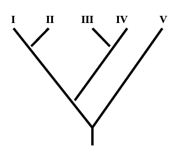
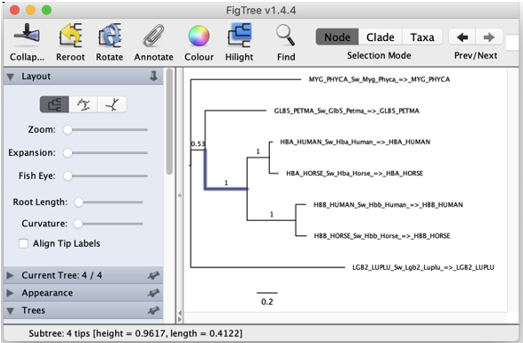

# Module 6 - Phylogeny

The purpose of these exercises is to show you ways to construct phylogenetic trees based on **multiple sequence alignments (MSA)**. To construct the phylogenetic trees we will use http://www.phylogeny.fr/ , a simple online solution suitable for relatively small phylogenetic analyses. For more complex situations with several hundred taxa and/or genes it is common to use a computer cluster for the calculations since they can be computationally very demanding.

For visualization we will use FigTree (http://tree.bio.ed.ac.uk/software/figtree/). Online visualization tools also exists but FigTree gives you some more flexibility.


### The pipeline

There are three different choices under the "Phylogenetic analysis" tab in the top left corner on http://www.phylogeny.fr/:
- **One Click**: Here you can paste your set of sequences and let the software make decisions on your behalf (Each step is optimized for your data).
- **Advanced**: Allows you to Manually set parameters for the various steps.
- **A la Carte**: Create your own workflow.

We will use the **A la Carte** option for these exercises, that way we will have full control of all the steps in the pipeline.
The steps are i) _creating multiple sequence alignments_, ii) _remove non-homologous characters_ (in the pipeline this is called "curation") iii) _phylogenetic tree inference_ and iv) _simple tree visualization_.


Typical phylogenetic pipeline:


**Alignments:**
Constructing phylogenetic trees based on molecular data presupposes a good multiple sequence alignment (MSA) of the sequences (DNA or RNA).  There are several different algorithms to choose from with different strengths and weaknesses. Some are very fast, but less accurate. Some are good if the difference between sequences (or the evolutionary distance) to be aligned are large. Included in the http://www.phylogeny.fr/ are four commonly used algorithms.

**Curation:**
Often regions of a multiple sequence alignment can be ambiguously aligned, or sometimes they are plainly wrong. One of the assumptions for making a phylogenetic tree is that the aligned characters in the alignment share the same evolutionary history. If wrongly aligned characters are used for tree inference there is a chance that the resulting tree is wrong as well. Luckily there are ways of computationally identify uncertain regions of an MSA and automatically remove them. The phylogeny.fr pipeline offers one of these programs called Gblocks.

**Tree inference**
The pipeline offers several ways to construct phylogenetic trees: 1) Maximum Likelihood (ML), 2) Parsimony, 3) Distance based Neighbor joining and 4) Bayesian inference with MrBayes. Of these ML (with bootstrap) and Bayesian inference are more computational demanding than the other two, and usually take longer time to compute. Parsimony and Distance based methods for tree construction are seldom used in modern phylogenetic analyses, although they sometimes produce trees that are quite similar to those constructed with ML and Bayesian inference.


**Storing trees as text**:
Trees are usually stored in simple text formats that describe the _branching patterns_, and the _branch lengths_. There are currently several text-based formats for storing trees (Nexus, treexml, treedyn etc). One of the simplest is the Newick format, which illustrates phylogenetic trees a series of nested parentheses. Branches sharing a common _node_ are within the same set of parentheses.
For instance, the following tree is described in the Newick format as : (((I,II),(III,IV)),V).



Trees in Newick format can in addition to sequence/taxon names have branch length specifying the distance between nodes, and support values for the branches.

The nexus format allows more information to be stored in the same file (trees, alignment, taxa tables with, simple formatting, colors etc.). But we will stick to Newick in this lab.  


###
## Exercise 6.1 Group exercises
For the first exercise each group will
- Draw  a phylogenetic tree manually (for instance with pen and paper) corresponding to a tree described in the Newick format
- Make a tree based on the sequences of hemoglobin in [Ex1_hemoglobin.fasta](Ex1_hemoglobin.fasta) (you can read about hemoglobin here https://en.wikipedia.org/wiki/Hemoglobin). The abbreviations used in the file are_Hbb_ = hemoglobin beta chain; _Hba_ = hemoglobin alpha chain; _Glb5_Petma_  = globin V from Petromyzon marinus (nineeye); _Lgb2_Luplu_ = leghemoglobin II from Lupinus luteus (lupines) ;_Myg_Phyca_ = myoglobin from Physeter catodon (sperm whale)  


You can set up the pipeline after choosing the **A la Carte** in the dropdown menu. When you set up the pipeline choose **Step by step**  which will provide an output for each step of the pipeline and allows you to inspect the result and set up extra parameters for each step.

Use the setting for your group as specified in the padlet
https://uio.padlet.org/anderkkr/gnad1pe87v2w7ocs

click **create workflow**.

After setting up the pipeline you will be taken to the next page where you can paste or upload the hemoglobin sequences ([Ex1_hemoglobin.fasta](Ex1_hemoglobin.fasta)). Hit **submit** and the sequence alignment will be constructed. The graphical output shows you how conserved the characters in the alignment are compare to the BLOSUM62. Higher scoring regions are more conserved. You are given the option to save the MSA in several formats if you want to. This is not strictly necessary for this exercise since the alignment was done quite quickly. But if it had taken a long time (for larger alignments this step can take hours!) you probably would have wanted to save the result for safekeeping.

Click **next step**.  

Then: Mark the boxes corresponding to the settings for your group in the padlet. Hit "submit". Now you will have a graphical representation of the curation process. The blue line underneath the alignment shows which regions  have passed the curation process.

Click **next step**  

In the Phylogeny menu you might need to change some settings depending on the setup in your groups padlet.  
Click "submit", wait a little bit and the first tree is ready! Save it to your computer in the Newick format. You can now inspect it using use the (limited) tree viewing option in the pipeline OR for more flexibility use FigTree (http://tree.bio.ed.ac.uk/software/figtree/). This program offers ways to rearrange the tree, change fonts, color branches etc. It also allows you to export the trees in commonly used graphic formats (jpg, png, pdf, bmp).

**Using Figtree**:
Download, install and run FigTree. Open the tree you just saved (click "file" and "open"). Click OK when you are asked for a name for the nodes/branches. Now you are looking at an unrooted tree without bootstrap values printed. First, we should add the bootstrap values. You will have to go to the menu option "Branch Lables" and set the labels to be displayed to "label" to see the bootstrap values.

Now lets fix the root. For this particular tree we can choose to set the root between the hemoglobin sequences and the other version of globin. To achieve this, mark the branch leading to the tips called HBA_xxx and HBB_xxx. Then Click "Reroot" (see figure).


  
_Figure of unrooted tree, with support values_


Each groups should provide the manually drawn tree, and a screenshot (or "proper" figure file) of the tree they generated with the pipeline. Finally answer these questions related to your tree:

```diff
! How do you interpret the bootstrap values and how are these computed?
! What does the tree tell you about the evolution of globin,
! and in particular the evolution of the two chains of hemoglobin?
! Do you trust your tree? Why or why not?
````

**The rest of the exercises you can do individually or continue working in groups if you prefer.**

## Exercise 6.2. Studying Evolution using Protein Sequences  

The vertebrate eye lens is an organ that is already present in the embryo in early stages of development. One remarkable feature of the lens is that is consists of cell layers, like the layers of an onion. Growth takes place at the outside; the inner part of the lens is therefore just as old as its carrier is! This also means that old cells will not be replaced by new ones contrary to what happens in other parts of the body. This imposes high demands in terms of stability to the constituting parts of these cells. Moreover, it has to be transparent for light - something that comes in quite handy for a lens.
 The alpha-crystallin protein is one of the most important constituents of the eye lens. This protein fulfills a key role in maintaining stability and structure of the lens. Its precise working is not completely known, but we know that the protein is a member of the widely occurring small heat shock protein (HSP20) family. The 3-dimensional structure of a distant relative of the protein has be elucidated some time ago. Since alpha-crystallin plays such an important role, it evolves at a very slow rate.

**Calculation of the alpha-crystalline tree**:
Use the protein sequences in the file [Ex2_alphacrystalline.fasta](Ex2_alphacrystalline.fasta) :

Calculate a tree with _Muscle_, _"less stringent"_ curation, and _ML_, choose "Approximate Likelihood-Ratio Test (aLRT)" as support values.

```diff
Look at the tree in FigTree. Any surprises?
```
## Exercise 6.3
**A tree with an "error"?**
Calculate a tree using Muscle and ML with Approximate Likelihood-Ratio Test (aLRT) with the sequences in [Ex3_alphacrystaline.fasta](Ex3_alphacrystaline.fasta).  :

```diff
! Place the root on the most logical branch.
! What is strange about this tree?
! Can you explain this?
```

## Exercise 6.4
**The complete picture**
Finally we use all the alpha crystallins [Ex4_alphacrystaline.fasta](Ex4_alphacrystaline.fasta)

Calculate the tree using Muscle and ML with Approximate Likelihood-Ratio Test (aLRT) .  :

```diff
! Where do you place the root?
! How would you describe this tree?
! This should clarify the picture that we got in the previous exercise?
```
