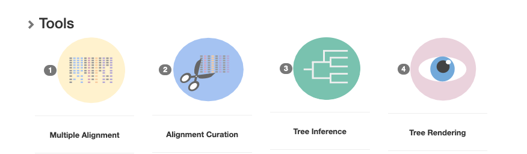
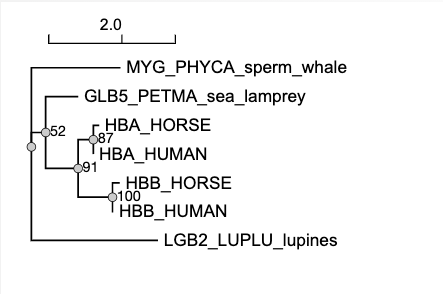
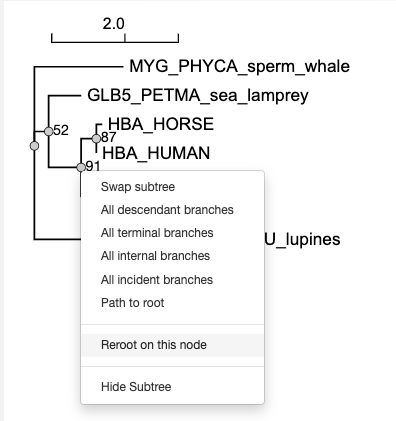

# Module 6 - Phylogeny

The purpose of these exercises is to show you ways to construct phylogenetic trees based on multiple sequence alignments (MSA). To construct the phylogenetic trees, we will use the pipeline provided on https://ngphylogeny.fr/analysis. This online solution is suitable for relatively small phylogenetic analyses. For more complex situations with several hundred taxa and/or genes it is common to use a computer cluster for the calculations since they can be computationally very demanding.

For visualization of the inferred tree there are also several options. In this lab we will use the visualisation provided by the same pipeline. If you want more flexibility You can also use iTol (https://itol.embl.de/) which is a good online solution. Or, if you prefer to have a program local on your computer, I recommend FigTree (http://tree.bio.ed.ac.uk/software/figtree/). 


### The pipeline

There are three different ways of running the pipeline on  https://ngphylogeny.fr/analysis:
- **One Click**: Here you can paste your set of sequences and let the software make decisions on your behalf, the only part you need to decide is what kind of tree you want to build (FastME, PhyML, FastTree etc.). 
- **Advanced**: Allows you to manually set parameters for the various steps.
- **A la Carte**: Create your own workflow. Even more flexible than the Advanced option. 

We will use the **Advanced** option for these exercises so that we can modify the steps in the pipeline. The steps are i) **Multiple Alignment**, ii) **Alignment Curation** (i.e. removal of non-homologous characters or badly aligned characters), iii) **Tree inference** and iv) **Tree visualization**.



Figure of typical phylogenetic pipeline, from  https://ngphylogeny.fr/analysis.


**Mutlipe Alignments:**
Constructing phylogenetic trees based on molecular data presupposes a good multiple sequence alignment (MSA) of the sequences (DNA, RNA or AA).  There are several different algorithms to choose from with different strengths and weaknesses. Some are very fast, but less accurate. Some are good if the difference between sequences (or the evolutionary distance) to be aligned is large. There are three commonly used algorithms included in the ngphylogeny.fr pipeline. For amino acids *Muscle* and *MAFFT* are good options.

**Curation:**
Regions of a multiple sequence alignment can often be ambiguously aligned, or sometimes plainly wrong. One of the assumptions for making a phylogenetic tree is that the aligned characters in the alignment share the same evolutionary history. If wrongly aligned characters are used for tree inference, there is a chance that the resulting tree is wrong as well. Luckily, there are ways to computationally identify uncertain regions of an MSA and automatically remove them. The ngphylogeny.fr pipeline offers a selection of four  of these programs, all with slightly different approaches for removing unaligned characters. For this exercise, we will stick with BMGE.

**Tree inference:**
The pipeline offers several algorithms for contruction of phylogenetic trees: 
  1) **FastME** - Short for Fast Minimal Evolution. This is basically a *distanced based Neighbour Joining* algorithm with some additional featues. 
  2) **TNT** - an abbreviation of "Tree analysis using New Technology" which is sort of ironical since the program dates back to 1999... It is a program for phylogenetic analysis under *parsimony* with very fast tree-searching algorithms.
  3) **PhyML+SMS** - Phylogeny based on *Maximum Likehelihood* with Smart Model Selection. 
  4) **PhyML** - Phylogeny based on *Maximum Likehelihood*. A very popular program for contructing phylogenetic trees with many different models to select from. 
  5) **FastTree** - *approximately-maximum-likelihood* phylogenetic trees. This program is superfast and uses a combination of NJ, ME and ML to achieve very good results, 100 to 1000 times faster than PhyML.
  6) **MrBayes** -  a program for *Bayesian inference* and model choice across a wide range of phylogenetic and evolutionary models. MrBayes uses Markov chain Monte Carlo (MCMC) methods to estimate the posterior distribution of model parameters.

Of these, maximum likelihood (PhyML) and Bayesian (MrBayes) inference are more computational demanding and usually takes longer time to compute. However, they are more accurate than parsimony and distance based methods especially for more distantly related taxa or genes. 

**Storing trees as text**:
Trees are usually stored in simple text formats that describe the _branching patterns_ and the _branch lengths_. There are currently several text-based formats for storing trees (Nexus, treexml, treedyn etc). One of the simplest is the Newick format, which illustrates phylogenetic trees as a series of nested parentheses. Branches sharing a common _node_ are within the same set of parentheses.

For instance, the following tree is described in the Newick format as: (((I,II),(III,IV)),V)


Trees in Newick format can in addition to sequence/taxon names have branch length specifying the distance between nodes, and support values for the branches.


###
## Exercise 6.1 Group exercises
For this exercise, each group will provide an answer to Canvas (under Diskusjoner) to these points:
- Draw  a phylogenetic tree manually (for instance with pen and paper) corresponding to a tree described in the Newick format for your group on Canvas.
- Make a tree based on the sequences of [hemoglobin](https://en.wikipedia.org/wiki/Hemoglobin) in [Ex1_hemoglobin.fasta](Ex1_hemoglobin.fasta) and with the tree inference parameters specific to your group. See how to do this below. Each group should provide the manually drawn tree, and a screenshot (or a proper figure in jpeg or png) of the tree generated with the pipeline. In addition, the questions below should be answered and related to your treee.

```diff
! How do you interpret the bootstrap values and how are these computed?
! Where did you place the root, and why?
! What does the tree tell you about the evolution of globin?
! and in particular the evolution of the two chains of hemoglobin?
! Do you trust your tree? Why or why not?
````

**Steps for running the pipeline** 
- Choose the **Advanceded workflow** option. Use the setting for your group as specified on Canvas.
- Select the workflow specific for your group and click the green button with "Advanced options".
- Paste or upload the hemoglobin sequences ([Ex1_hemoglobin.fasta](Ex1_hemoglobin.fasta)) under "Configure your workflow" and "Input data".
- Expand the menu for your group's tree inference method by clicking the **"+"** sign and make sure that bootstrap branch support is specified. Set the number of boostraps to (at least) 100. 
- Hit **submit**. The pipeline will run for a minute or so (depending on the the queue, the tree construction method, and the number of boostraps). When it is done, look for the green button marked "Viewer". 

The tree will be unrooted and looks something like this

  
_Figure of unrooted tree, with support values_


You will have to decide where to put the root. If you click one of the nodes on the tree a menu appears that allows you to do some simple manipulation of the tree. For instance you can choose where to place the root, by selecting "Reroot on this node". Also make sure that "Display support values" are selected under Tree settings. You can try to place the root at different places on the tree and see how it affects the final result. 




PS: The abbreviations used in the ([Ex1_hemoglobin.fasta](Ex1_hemoglobin.fasta)) file are *Hbb* = hemoglobin beta chain; *Hba* = hemoglobin alpha chain; *Glb5_Petma* = globin V from Petromyzon marinus (sea lamprey); *Lgb2_Luplu* = leghemoglobin II from Lupinus luteus (lupines); *Myg_Phyca* = myoglobin from Physeter catodon (sperm whale). 

**The rest of the exercises you can do individually or continue working in groups if you prefer. You don't have to upload answers to Canvas**

## Exercise 6.2. Studying Evolution using Protein Sequences  

The vertebrate eye lens is an organ that is already present in the embryo in early stages of development. One remarkable feature of the lens is that is consists of cell layers, like the layers of an onion. Growth takes place at the outside; the inner part of the lens is therefore just as old as its carrier is! This also means that old cells will not be replaced by new ones contrary to what happens in other parts of the body. This imposes high demands in terms of stability to the constituting parts of these cells. Moreover, it must be transparent for light - something that comes in quite handy for a lens. The alpha-crystallin protein is one of the most important constituents of the eye lens. This protein fulfils a key role in maintaining stability and structure of the lens. Its precise working is not completely known, but we know that the protein is a member of the widely occurring small heat shock protein (HSP20) family. The 3-dimensional structure of a distant relative of the protein has been elucidated some time ago. Since alpha-crystallin plays such an important role, it evolves at a very slow rate.

**Calculation of the alpha-crystalline tree**:
Use the protein sequences in the file [Ex2_alphacrystalline.fasta](Ex2_alphacrystalline.fasta) :

Setup the pipeline with the **Advanced workflow** option and calculate a tree with _MAFFT_, _BMGE_ curation, and _PhyML_. Choose _bootstrap_ under Statistical test for branch support in the advanced settings, and set it to 100.

```diff
! Look at the tree and decide where to place the root. 
! Any surprises?
```
## Exercise 6.3
**A tree with an "error"?**
Calculate a tree using MAFFT and PhyML with 100 bootstrap replicates using the sequences in [Ex3_alphacrystaline.fasta](Ex3_alphacrystaline.fasta).  :

```diff
! Place the root on the most logical branch.
! What is strange about this tree?
! Can you explain this?
```

## Exercise 6.4
**The complete picture**
Finally we use all the alpha crystallins [Ex4_alphacrystaline.fasta](Ex4_alphacrystaline.fasta)

Calculate the tree using MAFFT and PhyML with 100 bootstrap:

```diff
! Where do you place the root?
! How would you describe this tree?
! This should clarify the picture that we got in the previous exercise!
```
